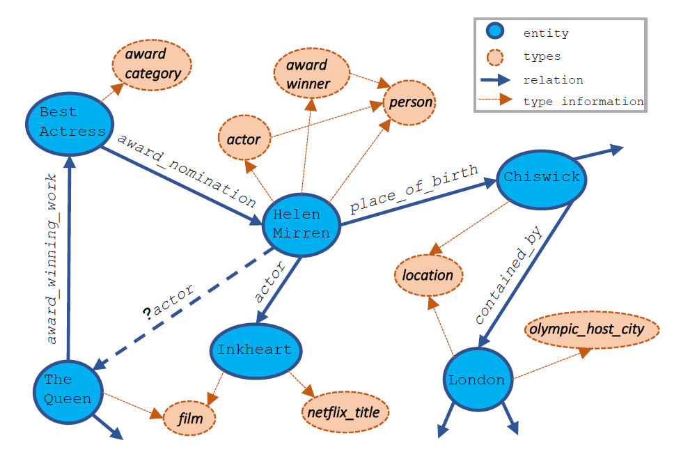

# Type-augmented relation prediction in knowledge graphs
> Zijun Cui, Pavan Kapanipathi, Kartik Talamadupula, Tian Gao, and Qiang Ji (AAAI 2021)

This is a folder for method: Type-augmented Relation Prediction
 
Folder `Embedding-based-Models` is for likelihood score calculation with embedding-based models

Folder `Prior-Model-with-Types` is for prior score calculation 

To integrate the likelihood score with the prior score for final prediction
Run: `combine_Likelihood_Prior.py`
